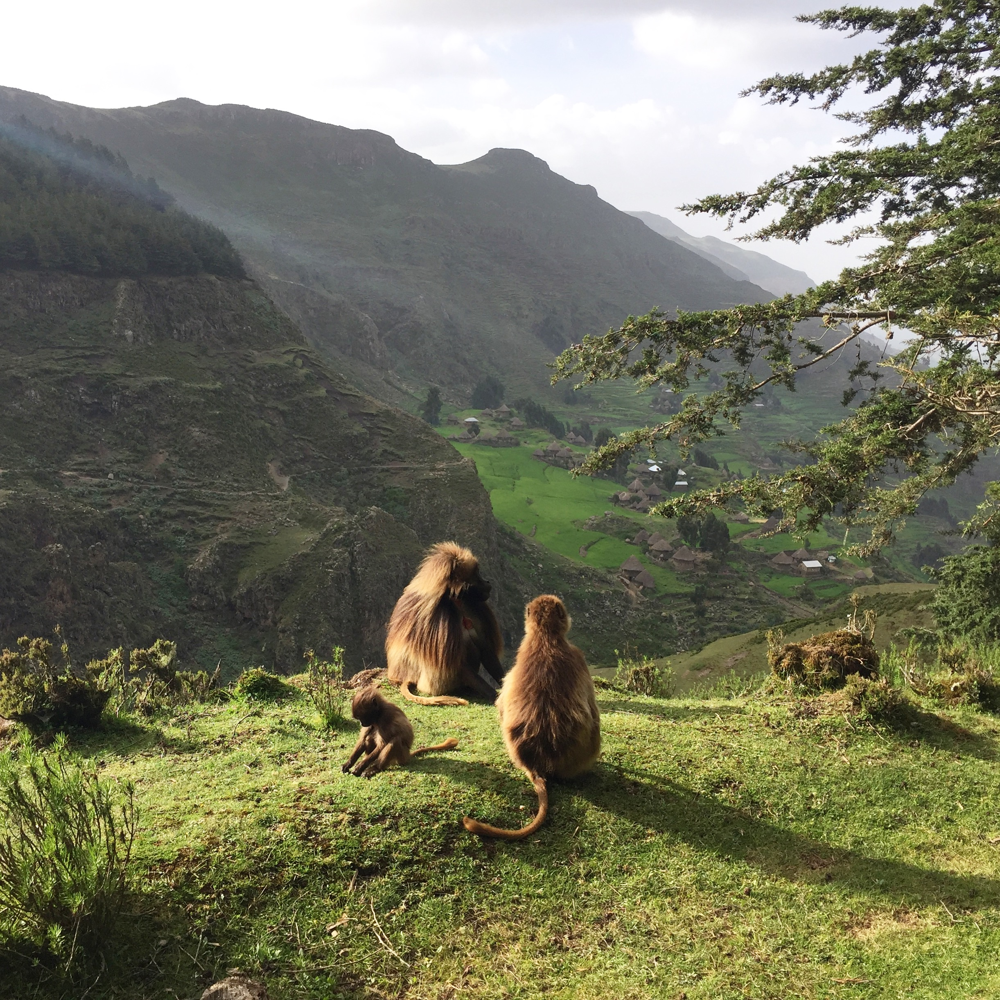

```{r setup, include=FALSE}
knitr::opts_chunk$set(
	echo = TRUE,
	message = FALSE,
	warning = FALSE
)
library(tidyverse)
library(here)
library(readxl)
library(ggfortify)
library(lubridate)
library(janitor)
```

## Introduction
Principle component analysis is an awesome way to visualize data that is more than 2D, and can help tease out relationships between variables. In this blog I will explore how Gelada monkeys and rodent eating predators share space. I collected this data in the Menz-Guassa Conservation Area in the highlands of Ethiopia from January-May 2018 as part of my work with the Guassa Gelada Research Project. The data is composed of point counts for birds of prey, Gelada monkeys, and Ethiopian wolves, and was collected with the goal of seeing how Geladas impact hunting behavior of animals that eat rodents. This project was inspired by [this](https://academic.oup.com/jmammal/article/96/1/129/864820) study by Dr. Venkataraman that found Ethiopian wolves hunt rodents more successfully in the presence of Geladas. Here I will only explore how animal presence/absences are correlated with the presence/absence of other species.

No idea what a gelada monkey is? Here's a picture I took!




## PCA Plot
```{r, fig.width=8}
#read in data stored then clean names and replace NA value with 0
sky_focals <- read_excel(here("Sky_Focals_Complete.xls")) %>% 
  clean_names() %>% 
  mutate_all(~replace(., is.na(.), 0))

#Limit to animal observations
sky_focals_limited <- sky_focals %>% 
  select(number_gels, aug, taw, harrier_sp, e_wolves)

#Change Everything to Numeric!
sky_focals_limited$number_gels <- as.numeric(sky_focals_limited$number_gels)
sky_focals_limited$aug <- as.numeric(sky_focals_limited$aug)
sky_focals_limited$taw <-as.numeric(sky_focals_limited$taw)
sky_focals_limited$harrier_sp <- as.numeric(sky_focals_limited$harrier_sp)
sky_focals_limited$e_wolves <- as.numeric(sky_focals_limited$e_wolves)

#changing the names of columns
colnames(sky_focals_limited) = c("Number of Geladas", 
                                 "Augur Buzzards", 
                                 "Tawny Eagles", 
                                 "Harriers", 
                                 "Ethiopian Wolves")

#PCA
sky_focal_pca <- sky_focals_limited %>%
  scale() %>% #I used the scale function to limit the impact that Geladas would have on the variance. 
  #It is normal to have 300+ Geladas in a troop, but not normal for birds of prey to group together.
  prcomp()

#call to view
sky_focal_pca

#PCA bi-plot
autoplot(sky_focal_pca, 
         data = sky_focals,
         loadings = TRUE, 
         loadings.label = TRUE,
         loadings.label.hjust = 1.2) +
  theme_classic() +
  labs(caption = 
         "Principle Component Analysis Bi-plot Showing Species Associations in the Highlands of Ethiopia.
Data and Graph: Iris foxfoot") 
```

## Conclusions

So how do you interpret a PCA biplot? There's a lot that goes into a PCA biplot, but some of the main takeaways are that the angles of the arrows show how correlated characteristics are. If they are closer than 90 degrees, they are positively correlated, at 90 degrees they are uncorrelated, and if they are more than 90 degrees apart, they are negitively correlated. The length of the arrows also conveys information about how much weight a characteristic has in a Principle Component. So what are my main conclusions?

- The number of Gelada monkeys and the number of Ethiopian wolves are positively correlated. This result upholds Dr. Venkataraman's study!

- Geladas are moderately negatively correlated with Augur Buzzards, while Geladas and Tawny Eagles are more negatively correlated. Interesting!

- Augur Buzzards and harrier species are very negatively correlated. This is a great example of a pattern I never would have investigated if I hadn't used PCA as an exploratory tool. Always explore your data!

